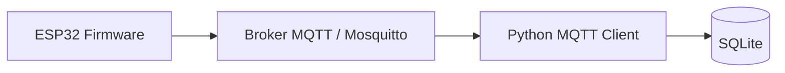

# IoT Energy Monitoring Platform

Sistema IoT para adquisicion, publicacion, almacenamiento y consulta de lecturas de sensores usando ESP32, MQTT, Python y SQLite.

El proyecto esta pensado como una plataforma base para monitoreo energetico. Actualmente simula sensores de temperatura desde un ESP32, publica las lecturas por MQTT y un backend en Python las consume para almacenarlas en una base de datos SQLite.

## Caracteristicas

- Firmware para ESP32 desarrollado con ESP-IDF.
- Conexion WiFi configurable desde `menuconfig`.
- Publicacion de datos por MQTT.
- Arquitectura modular en C para manejar varios sensores con `struct` y punteros a funcion.
- Suscripcion del backend a uno o varios topicos MQTT.
- Persistencia de lecturas en SQLite.
- Configuracion del backend mediante variables de entorno.
- API REST con FastAPI en desarrollo.

## Arquitectura Actual



Flujo principal:

1. El ESP32 se conecta a WiFi.
2. El firmware lee los sensores configurados.
3. Cada sensor publica su lectura en un topico MQTT.
4. El backend se suscribe a los topicos configurados.
5. Cada mensaje valido se guarda en SQLite.

## Conocimientos Aplicados

- Programacion embebida con ESP32 y ESP-IDF.
- Comunicacion MQTT entre firmware y backend.
- Diseno modular en C usando estructuras, arreglos de sensores y punteros a funcion.
- Separacion entre interfaz generica de sensores e implementaciones concretas.
- Backend Python para ingesta de datos MQTT.
- Persistencia de datos con SQLite.
- Configuracion mediante variables de entorno.
- Documentacion tecnica orientada a ejecucion y mantenimiento.

## Requisitos

- ESP-IDF v6.0.1.
- Python 3.14.6 o compatible.
- Mosquitto MQTT Broker.
- Paquete Python `paho-mqtt`.
- MQTT Explorer, opcional para inspeccionar mensajes.

## Estructura Del Proyecto

```text
.
├── backend/
│   ├── config.py
│   ├── database.py
│   ├── main.py
│   ├── models.py
│   └── mqtt_client.py
├── database/
│   └── sensors_data.db
├── docs/
│   ├── images/
│   └── project_state.md
└── firmware/
    └── esp32_energy_monitor/
        ├── lib/
        │   ├── inc/
        │   └── src/
        └── main/
```

## Configuracion Del Backend

El backend lee su configuracion desde variables de entorno.

| Variable | Valor por defecto | Descripcion |
| --- | --- | --- |
| `MQTT_BROKER_HOST` | `localhost` | Host o IP del broker MQTT. |
| `MQTT_BROKER_PORT` | `1883` | Puerto del broker MQTT. |
| `MQTT_TOPICS` | `esp32/sensor_temperatura/#` | Lista de topicos MQTT separados por coma. |
| `SENSOR_DATABASE_PATH` | `database/sensors_data.db` | Ruta del archivo SQLite. |

Ejemplo:

```bash
export MQTT_BROKER_HOST=localhost
export MQTT_BROKER_PORT=1883
export MQTT_TOPICS=esp32/sensor_temperatura/#
export SENSOR_DATABASE_PATH=database/sensors_data.db
```

Tambien se pueden indicar varios topicos explicitos:

```bash
export MQTT_TOPICS=esp32/sensor_temperatura/habitacion_1,esp32/sensor_temperatura/habitacion_2
```

## MQTT Topics

Topicos usados actualmente por el firmware:

| Topico | Descripcion |
| --- | --- |
| `esp32/sensor_temperatura/habitacion_1` | Lecturas del sensor de temperatura de la habitacion 1. |
| `esp32/sensor_temperatura/habitacion_2` | Lecturas del sensor de temperatura de la habitacion 2. |

El backend puede escuchar todos los sensores de temperatura con:

```text
esp32/sensor_temperatura/#
```

## Payload MQTT

Formato esperado por el backend:

```json
{
  "sensor": "temperatura",
  "value": "24.00",
  "unit": "celsius",
  "timestamp": "12:30:10"
}
```

Campos:

| Campo | Tipo | Descripcion |
| --- | --- | --- |
| `sensor` | string | Tipo o nombre del sensor. |
| `value` | number/string | Valor numerico de la lectura. |
| `unit` | string | Unidad de medida. |
| `timestamp` | string | Hora de lectura en formato `HH:MM:SS`. |

## Ejecucion Del Backend

Crear entorno virtual:

```bash
python -m venv .venv
source .venv/bin/activate
```

Instalar dependencias:

```bash
pip install paho-mqtt
```

Ejecutar el consumidor MQTT:

```bash
python backend/main.py
```

El backend inicializa la base de datos, se conecta al broker MQTT y guarda cada lectura valida en SQLite.

## Ejecucion Del Firmware

Entrar al proyecto ESP-IDF:

```bash
cd firmware/esp32_energy_monitor
```

Configurar WiFi y broker MQTT:

```bash
idf.py menuconfig
```

Compilar:

```bash
idf.py build
```

Cargar al ESP32 y abrir monitor serie:

```bash
idf.py flash monitor
```

## Verificacion Manual

1. Iniciar Mosquitto.
2. Ejecutar el backend.
3. Compilar y cargar el firmware en el ESP32.
4. Abrir el monitor serie para verificar conexion WiFi y MQTT.
5. Revisar en MQTT Explorer que llegan mensajes a los topicos configurados.
6. Confirmar que las lecturas se guardan en `database/sensors_data.db`.

## Evidencia

El directorio `docs/images/` contiene capturas del avance del proyecto:

- Comunicacion MQTT.
- Guardado de lecturas en SQLite.
- Guardado de varios sensores usando varios topicos.

## Estado Del Proyecto

- [x] Proyecto creado.
- [x] Conexion WiFi desde ESP32.
- [x] Publicacion MQTT desde ESP32.
- [x] Backend consumidor MQTT en Python.
- [x] Suscripcion a multiples topicos MQTT.
- [x] Base de datos SQLite.
- [x] Guardado de datos de varios sensores.
- [x] Simulacion basica de sensores.
- [ ] API REST con FastAPI.
- [ ] Consulta historica de lecturas desde API.
- [ ] Migracion opcional de SQLite a PostgreSQL.

## Roadmap

- Agregar identificadores estables por sensor (`sensor_id`).
- Implementar API REST con FastAPI.
- Exponer endpoints para consultar lecturas historicas.
- Agregar mas tipos de sensores.
- Mejorar el esquema de base de datos para registrar sensores y lecturas por separado.
- Preparar despliegue con Docker.
